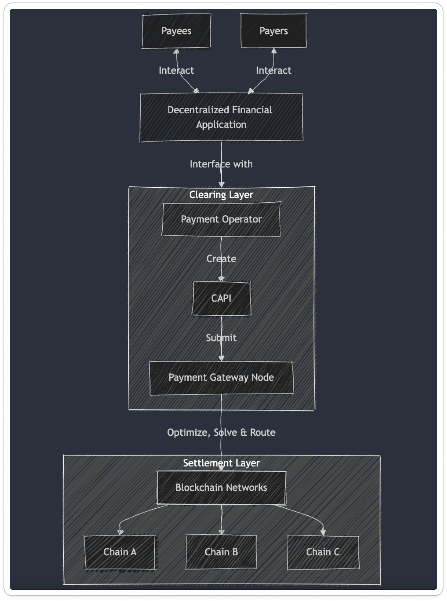

# **Grid: Payment Intent Protocol**

## Overview

Grid protocol is an open, modular and chain-abstracted framework for intent-based payments, designed to automate and process payment workflows. It provides developers and payment providers with a platform to build scalable decentralized financial applications (DFAs) while abstracting the complexities of operating across multiple chains. 

Grid simplifies clearing and settlement mechanisms by integrating programmable intents—composable or partial payment instructions— that facilitate orchestrating multi-party discovery, coordination, and execution. Acting as an independent payment layer, Grid network operates without relying on specific blockchain layers, eliminating the need to interact with components like RPC providers, public mempools, bridges or DEXs.

### Why Grid Protocol?

#### Challenges in the Payment Landscape:

> **Blockchain payment infrastructure is fragmented and challenging to scale, forcing developers to repeatedly build it from scratch**
 
➔ **Fragmented infrastructure:** Blockchain [PSP](https://nl.wikipedia.org/wiki/Payment_service_provider) developers must repeatedly rebuild and maintain payment stack components to facilitate on-chain payments across an increasing number of networks, leading to high operational costs. Delivering the best UX, ensuring performance and reliability, meeting SLAs, complying with [KYT/AML](https://pixelplex.io/blog/know-your-transaction/) regulations, and maintaining privacy add more complexity.

➔ **Reliability & Scalability risks:** Blockchain payments frequently depend on general-purpose RPC nodes and bridges, making them exposed to latency, privacy concerns, and third-party manipulation like front-running and negative MEV. This reliance leaves no opportunity for performance optimizations.

➔ **Limited Payment Capabilities:** Building advanced payment features at scale often require specialized expertise and costly in-house solutions that divert resources from core business priorities. *The complexity of designing different payment workflows and managing associated risks can be a significant challenge for teams to navigate.*
### Solution:
> **Connecting fragmented legos into a unified open payment stack so you don't have to**


## **Architecture Overview**

The architecture is centered around programmatic payment intents and consists of interconnected off-chain and on-chain components designed to orchestrate and secure payment workflows processing across different blockchain networks.



## **Key Components**
### Payment Gateway Nodes

Payment Gateway Nodes are the core off-chain clearing infrastructure of the network, serving as orchestrators and routers to optimize execution paths and ensure preference guarantees for payment intents. These nodes form a payment delivery network that can increase efficiency by reducing costs and latency while providing scalability through workload distribution.

### Payment Operators

Payment operators are payment service providers (PSP), fintechs or any builder facilitating payments or financial operations on behalf of a payer and payee(s). They are responsible for providing integration APIs and DApps for both payers and payees to interact with the payment network. Operators can configure operational parameters, such as network fee sponsors, authorized delegates, treasury addresses, fee structures, allowing for flexible fee distribution and enforcing business rules.

### Payment Intents

Payment Intents are primitives based on a declarative model that describe self-contained instructions for executing specific payment outcomes. Each `Payment Intent` define parameters such as the source and destination domains, amount, recipient(s), and any conditions or constraints required for execution. These primitives support multi-step or complex transactions, including recurring, batch payments, conditional transfers, and multi-party settlements, allowing for flexible, programmable payment flows. 

Payment Intents streamline transaction logic, reduce execution errors, and provide an auditable trail, enabling automated workflows through integration with smart contracts. The struct specifies the following:
- **Payment ID:**  A unique identifier for the payment intent _**(generated or provided off-chain)**_
- **Payment type (one-time, recurring, etc)** 
- **Operator configuration data:** 
    - Operator ID 
    - Operator: The address of operator who is facilitating the payment processing
    - Authorized signers: An address array of authorized addresses delegated to initiate and/or sign the payment intent data
    - Treasury account
    - operator URI
    - Fee: The percentage rate to deduct from transfer `amount` and distribute to the operator's treasury wallet. This must be less than or equal to the transfer `amount`. _( Example operator fee = 1 mean its 1%)_
    - Network fee sponsor: Flexible approach for managing network fees, that can be covered by either the operator, payment node, payer, or payee.
- **Amount** 
- **The source domain:**
    - Wallet address
    - Network ID
    - Payment token
- **The destination domain:**
    - Wallet account address (multiple addresses allowed for multi-party payments)
    - Network ID
    - Payment token
- **Processing date** **(only if scheduled in the future and set on-chain if not defined)**
- **Payment expiration timestamp** **( required = permit2 signature transfer `deadline`)**
- **Nonce** **(required = permit2 signature nonce)**
- **p2_signature:** the payer permit2 signature
- **Schedule object parameters**: **(required if payment intent type is recurring)**
    The payment schedule to be executed. If a schedule is provided, the payment is automatically set up as a recurring (or standing order). If no schedule is specified, the payment will be executed only once.
    - **interval_unit**
        - The unit of the recurring interval. Possible values: `day` ,`week`, `month`, `year`
    - **interval_count**
        - The number of recurring interval_units between originations. The recurring interval is calculated by multiplying interval_unit and interval_count. For example, to schedule a recurring transfer which originates once every two weeks, set interval_unit = week and interval_count = 2.
        - A value of 0 means the transfer will be executed immediately
	- **iterations** 
		- Integer representing the multiplier applied to the price interval. For example, **`iterations=2`** applied to a price with **`interval=month`** and **`interval_count=3`** results in a phase of duration **`2 * 3 months = 6 months`**. If set, **`end_date`** must not be set.
    - **start_date**
        - A date in timestamp format.
    - **end_date** **_(should not be taken into consideration if_ iterations _provided)_**
        - A date in timestamp format.
- **payment_reference** **(optional)**: End-to-end external reference for off-chain reconciliation, tracking and post-payment actions
- **metadata**:  This field allows definition of arbitrary metadata and intent-type specific information
 
> 🔒 Along with these attributes, a **`PaymentIntent`** must be authorized by the operator (or an approved delegate) by producing a EIP-712 or EIP-1271 signature. This allows authentication and for operator to control how and when intent processing happens and be selective about what payments to allow based on their business logic, internal policies, legal requirements, or other reasons. It also ensures that a **`PaymentIntent`** cannot be forged or have its data modified in any way.

----

### **Payment Status Tracking**
  
- **Processing**: The payment transfer intent has been validated and created
- **Completed**: The payment transfer intent has been successfully processed and confirmed. This indicates that the funds have been transferred.
- **Scheduled:** The payment transaction is scheduled for processing at a specific time interval or recurring cycle.
- **Cancelled**: The payment has been cancelled by the operator or either transaction parties
- **Failed**: The payment transaction encountered an error or was reverted for some reason preventing the transaction from being completed.

### Payment Status Update: [IPN Webhooks](https://en.wikipedia.org/wiki/Instant_payment_notification)

IPN is a specific type of webhook typically used in financial or eCommerce contexts to communicate changes in payment status. Payment status events during the payment intent lifecycle are recorded by a **`PAYMENT_STATUS_UPDATE`** event emitted by the protocol with the following details:

- The unique id of the **`PaymentIntent`**
- The operator ID
- The operator address 
- The payment execution date
- The next payment date
- The payment status code
- Payment reference and metadata for reconciliation
- Description of the reason of failure or other edge cases
- The payer (sender) address
- The recipient address
- The payment token that was spent by the payer
- The amount of the payment token spent by the payer

```solidity
event PAYMENT_STATUS_UPDATE(
    bytes32 indexed paymentID,
    bytes32 indexed operatorID,
    address indexed operator, // 
    address sender,
    address receiver,
    uint256 amount,
    address payment_token,
    uint256 executed_date,
    uint256 next_payment_date,
    PaymentStatus status,
    string payment_reference,
    string metadata,
    string reason
);
```

In the case of errors, a specific error type is returned with details about what went wrong.
### Payment methods supported
Native and ERC-20 token transfers are supported along with cross-chain token settlements where we meet payers at their point of liquidity and guarantee that accounts receive funds in their preferred token(s).
## Deployments

The Grid Payment Protocol is currently in beta and has been deployed across the following networks. We are continuously expanding to additional networks over time. The `GridOperatorProxy` will be using a factory contract for easily deploying contracts to the same address on multiple chains, using [CREATE3]([https://github.com/zeframlou/create3-factory](https://github.com/zeframlou/create3-factory)).

| Network  | Environment     | Address                                    |
| -------- | --------------- | ------------------------------------------ |
| Ethereum | Mainnet         | TBD                                        |
| Ethereum | Sepolia Testnet | 0xCF8d61b1fD933aedd5fFBD586A2ECf991f926444 |
| Polygon | Mainnet         | TBD                                        |
| Polygon  | Amoy Testnet    | 0xCF8d61b1fD933aedd5fFBD586A2ECf991f926444 |
| Base     | Mainnet         | TBD                                        |
| Base     | Sepolia Testnet | TBD                                        |

- The entry point `GridPaymentGateway` contract is upgradeable during the beta phase, but later will be deployed as non-upgradeable and these addresses will change when new versions are deployed.
- Excluded from this repo is a copy of [Uniswap/permit2](https://github.com/Uniswap/permit2), which would be copied to `contracts/permit2` in order to compile.

### **Security Considerations**
- **Authorizations:** All payment operations are performed by authenticated and authorized operators by implementing signature verification and allowance checks for transactions. Each operation, especially those involving fund transfers, should require authorization from the involved parties. Authorizations can be limited in time and scope, and have constraints that describe limitations for payments. 
- **Self-Custody & Direct Debits Approvals:** Ensuring that all parties involved in transactions maintain control over their funds which are never locked in the protocol. This minimizes the risk of draining attacks and breaches from a central point of failure. Ensuring that transactions require explicit user approval via signatures schemes.
- Signature-based permit approvals via an extended Permit2 mechanism, eliminating the need for infinite and mismanaged allowances. This means reducing the attack surface by using Permit2 as a canonical contract for allowance approvals and transfer authorization. The signatures are valid only for the duration of the transaction in which it is spent.

---
Grid protocol is permissionless and free to use, experiment and build on top of. Reach out to us if you're interested to contribute to the future of payment technology.

